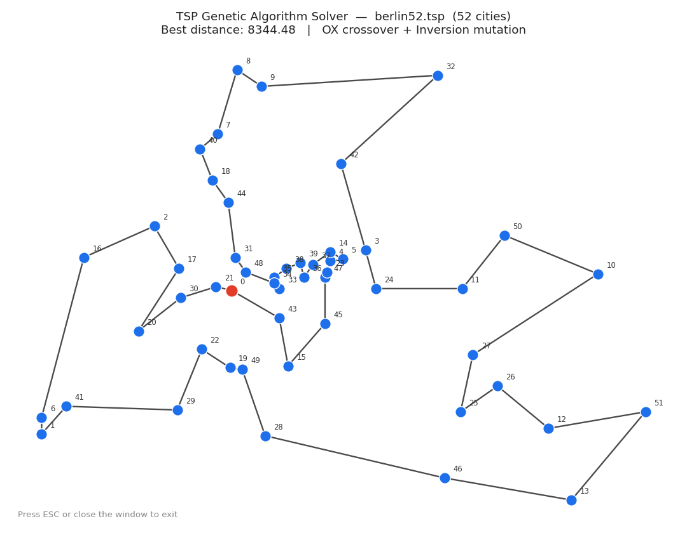

# TSP Genetic Algorithm Solver

[](https://github.com/RezaSparks/tsp-ga-solver/actions)

A cross-platform C++17 implementation of a Genetic Algorithm to solve the Traveling Salesman Problem (TSP), with real-time Raylib visualization, TSPLIB support, and multiple selectable GA operators.

## Features
- ✅ Real-time visualization of the evolving route (auto-scaled to fit any coordinate range, including real-world TSPLIB instances)
- ✅ Modular C++ architecture (GA core, TSP/city logic, Renderer, CLI, TSPLIB parser)
- ✅ Tournament selection
- ✅ Three crossover operators: **OX** (Ordered), **PMX** (Partially Mapped), **Cycle** — selectable via `--crossover`
- ✅ Three mutation operators: **Swap**, **Inversion**, **Scramble** — selectable via `--mutation`
- ✅ Elitism to preserve the best solutions
- ✅ Load cities from **CSV** (`--csv`) or **TSPLIB** `.tsp` files (`--tsplib`, EUC_2D instances)
- ✅ Multiple independent runs with aggregate statistics (`--runs`) — best/worst/avg/stddev across runs
- ✅ Convergence data export to CSV (`--output-csv`) for plotting
- ✅ Configurable population size, generations, and mutation rate via CLI flags
- ✅ Headless mode (`--headless`) for running without a display — CI, SSH, batch runs
- ✅ Reproducible runs via `--seed`
- ✅ Cross-platform CMake build (Linux, macOS, Windows — no Visual Studio required), with optional vcpkg support for faster local builds
- ✅ Unit tests with GoogleTest (18 tests: distance, crossover/mutation validity, elitism property, CSV loading)

## Demo



*This image shows real solver output — the actual best route found for the `berlin52` TSPLIB instance (52 cities), rendered from the solver's own coordinate and route data, in the same visual style as the live app (OX crossover + inversion mutation, seed 42).*

> **Note:** this is a static rendering of real solver output, not a live screen capture of the Raylib window (the environment used to prepare this image has no display attached). If you'd like an actual screen recording: run `./tsp_solver --cities 40 --generations 500` (drop `--headless`) and capture the window with your OS's screenshot/GIF tool (e.g. ScreenToGif on Windows, `Cmd+Shift+5` on macOS, Peek on Linux) — a short GIF of the route visibly improving over ~5-10 seconds makes a great addition here.

## How to Build

Requires CMake 3.16+ and a C++17 compiler (GCC, Clang, or MSVC).

### Option 1: Default (FetchContent — works everywhere, no setup)
Raylib, cxxopts, and (if building tests) GoogleTest are downloaded and built automatically.

```bash
git clone https://github.com/RezaSparks/tsp-ga-solver.git
cd tsp-ga-solver
cmake -B build -DCMAKE_BUILD_TYPE=Release
cmake --build build --config Release
```

### Option 2: vcpkg (faster local builds, if you already have vcpkg installed)
```bash
cmake -B build -DCMAKE_BUILD_TYPE=Release -DCMAKE_TOOLCHAIN_FILE=$VCPKG_ROOT/scripts/buildsystems/vcpkg.cmake
cmake --build build --config Release
```
CMake automatically detects whether vcpkg-installed packages (`raylib`, `cxxopts`, `gtest`) are available and uses them; otherwise it falls back to FetchContent. This means the same `CMakeLists.txt` works identically in CI (no vcpkg, no changes needed) and locally (vcpkg, faster rebuilds).

The executable is written to `build/tsp_solver` (or `build/Release/tsp_solver.exe` on Windows with the Visual Studio generator).

On Linux, you'll also need the X11/OpenGL dev headers Raylib builds against:
```bash
sudo apt-get install libgl1-mesa-dev libx11-dev libxrandr-dev libxinerama-dev libxcursor-dev libxi-dev
```

### Building with Tests

```bash
cmake -B build -DCMAKE_BUILD_TYPE=Release -DTSP_BUILD_TESTS=ON
cmake --build build --config Release
ctest --test-dir build --output-on-failure
```

## How to Use

### Basic Run (with visualization, random cities)
```bash
./tsp_solver --cities 30 --population 100 --generations 500 --mutation-rate 0.02
```

### Load a TSPLIB instance (EUC_2D only)
```bash
./tsp_solver --tsplib examples/berlin52.tsp --population 200 --generations 1000 --crossover ox --mutation inversion
```

### Load cities from CSV
```bash
./tsp_solver --csv examples/cities_20.csv --population 100 --generations 300
```

### Compare crossover/mutation operators over multiple runs (headless)
```bash
./tsp_solver --headless --tsplib examples/berlin52.tsp --crossover pmx --mutation scramble --runs 10 --seed 42
```

### Export convergence data for plotting
```bash
./tsp_solver --headless --cities 30 --generations 300 --output-csv convergence.csv
```
> Note: with `--runs > 1`, only the first run's convergence data is written (a single CSV can't cleanly represent multiple independent curves) — the console output still reports aggregate best/worst/avg/stddev across all runs.

### Reproducible Run (same result every time)
```bash
./tsp_solver --headless --cities 10 --population 50 --generations 200 --seed 42
```

### All CLI Flags
```bash
./tsp_solver --help
```

| Flag | Default | Description |
|------|---------|-------------|
| `--cities, -n` | 20 | Number of cities to randomly generate (ignored if `--tsplib` or `--csv` is used) |
| `--population, -p` | 100 | Population size (minimum 4 — elitism reserves 2 slots for the best routes, so anything less leaves no room for actual offspring) |
| `--generations, -g` | 500 | Number of generations to run |
| `--mutation-rate, -m` | 0.02 | Mutation probability (0.0–1.0) |
| `--crossover` | `ox` | Crossover operator: `ox`, `pmx`, `cycle` |
| `--mutation` | `swap` | Mutation operator: `swap`, `inversion`, `scramble` |
| `--tsplib` | — | Load cities from a TSPLIB `.tsp` file (EUC_2D only) |
| `--csv` | — | Load cities from a CSV file (header `x,y`, one city per line) |
| `--output-csv` | — | Export per-generation convergence data (best/avg fitness) to a CSV file |
| `--runs` | 1 | Number of independent runs; prints aggregate best/worst/avg/stddev |
| `--seed` | 0 | Random seed (0 = auto, any other value = fixed for reproducibility) |
| `--headless` | false | Run without opening the Raylib visualization window |
| `--help, -h` | — | Print usage and exit |

At the end of a run, the solver prints the best distance found and the full best route (visiting order + coordinates).

## Project Structure
- `/src` — Source files, including the main entry point
- `/include/ga` — Genetic Algorithm core (selection, crossover, mutation, elitism)
- `/include/tsp` — City/distance logic, CSV loader, TSPLIB parser
- `/include/visualization` — Raylib rendering
- `/include/cli` — CLI argument parsing
- `/examples` — Sample input files (CSV, TSPLIB) and ready-to-run commands
- `/tests` — Unit tests (GoogleTest)

## Tests

18 tests across 5 suites:

| Test Suite | What It Checks |
|------------|----------------|
| `DistanceTest` | Euclidean distance correctness, symmetry, zero distance for identical points |
| `CrossoverValidity` | OX, PMX, and Cycle crossover all produce valid permutations (no duplicates, no missing cities) across many seeds |
| `MutationValidity` | Swap, Inversion, and Scramble mutation all preserve permutation validity across many seeds |
| `ElitismProperty` | Best fitness never worsens across generations — holds under PMX+Inversion and under high mutation rates |
| `CsvLoader` | Valid CSV loads correctly; malformed/too-small/missing files are rejected with a clear error |

Run tests:
```bash
cmake -B build -DTSP_BUILD_TESTS=ON
cmake --build build
ctest --test-dir build --output-on-failure
```

## Benchmarks

Real results from this solver against `examples/berlin52.tsp` (52 cities, known optimal tour length: **7542**), 10 independent runs each, `--seed 100`/`--seed 200` for reproducibility:

| Crossover | Mutation | Population | Generations | Best | Avg | Worst | Std Dev | Gap to optimal |
|---|---|---|---|---|---|---|---|---|
| OX | Swap | 200 | 1000 | 8874.27 | 9636.52 | 10007.33 | 294.00 | +17.7% |
| PMX | Swap | 200 | 1000 | 9498.83 | 10538.72 | 11426.32 | 563.57 | +25.9% |
| Cycle | Swap | 200 | 1000 | 10554.94 | 11197.54 | 11947.18 | 477.54 | +39.9% |
| OX | Inversion | 300 | 2000 | **7825.42** | 8188.91 | 8470.43 | 225.92 | **+3.8%** |

Takeaways from this data:
- **OX consistently outperforms PMX and Cycle** on this instance at matched settings — both in best-found and consistency (lower std dev).
- **Inversion mutation clearly helps** over plain Swap: it makes larger, structured changes (reversing a sub-tour) that suit TSP's geometry better than swapping two arbitrary cities.
- With a larger population and more generations, OX+Inversion gets within **~3.8% of the known optimal** for berlin52 — a solid result for a GA without local search (2-opt hybridization, a roadmap item below, would likely close most of the remaining gap).

Reproduce these numbers yourself:
```bash
./build/tsp_solver --headless --tsplib examples/berlin52.tsp --population 300 --generations 2000 \
    --mutation-rate 0.03 --crossover ox --mutation inversion --runs 10 --seed 200
```

## Roadmap

- [x] Fix LICENSE
- [x] Replace `std::rand()` with modern `<random>`
- [x] Add `--seed` for reproducible runs
- [x] Add `--headless` mode
- [x] Refactor renderer API (auto-scales to fit any coordinate range)
- [x] Add unit tests with GoogleTest
- [x] Load cities from CSV files (`--csv`)
- [x] Load cities from TSPLIB files (`--tsplib`, EUC_2D)
- [x] Additional crossover operators (PMX, Cycle)
- [x] Additional mutation operators (Inversion, Scramble)
- [x] Multiple independent runs with aggregate statistics (`--runs`)
- [x] Convergence data export to CSV (`--output-csv`)
- [x] Optional vcpkg support alongside FetchContent
- [ ] Save/export the final best route to a file (currently console-only)
- [ ] Support additional TSPLIB distance types (ATT, CEIL_2D, GEO) — currently EUC_2D only
- [ ] 2-opt local search post-processing / GA+2-opt hybrid
- [ ] Convergence plots (matplotlib/gnuplot script consuming `--output-csv` output)
- [ ] Live web demo (Emscripten)

## License

MIT License — see [LICENSE](LICENSE) for details.
