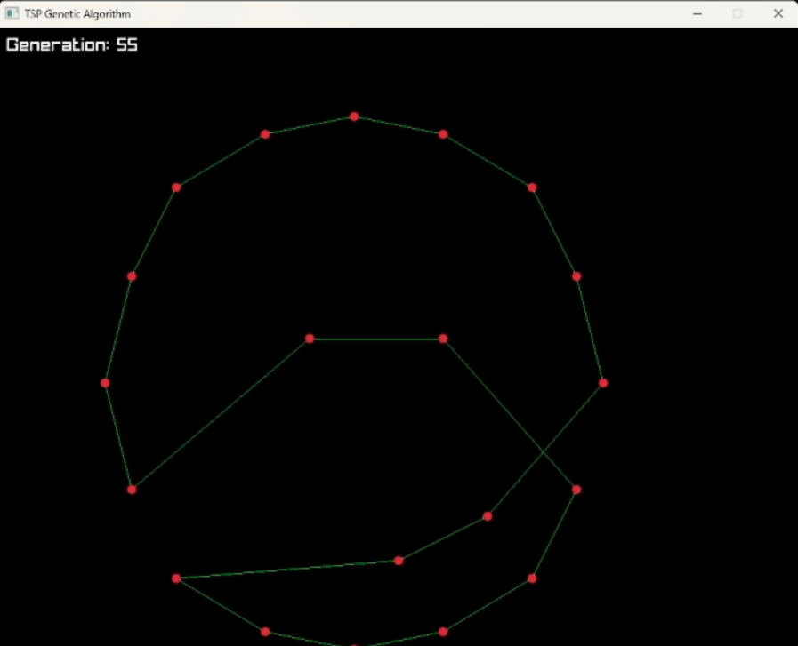

# TSP Genetic Algorithm Solver

[](https://github.com/RezaSparks/tsp-ga-solver/actions)

A cross-platform C++17 implementation of a Genetic Algorithm to solve the Traveling Salesman Problem (TSP) with real-time visualization using Raylib.

## Features
- ✅ Real-time visualization of the evolving route
- ✅ Modular C++ architecture (GA, TSP core, Renderer)
- ✅ Tournament selection + Ordered Crossover (OX)
- ✅ Elitism to preserve the best solutions
- ✅ Configurable population size, generations, and mutation rate
- ✅ Cross-platform CMake build (Linux, macOS, Windows — no Visual Studio required)

## Demo
*(Insert a screenshot here! Press Print Screen while the app runs, save as `screenshot.png` in the repo, and link it)*


## How to Build

Requires CMake 3.16+ and a C++17 compiler (GCC, Clang, or MSVC). Raylib is downloaded and built automatically — no manual install needed.

```bash
git clone https://github.com/RezaSparks/tsp-ga-solver.git
cd tsp-ga-solver
cmake -B build -DCMAKE_BUILD_TYPE=Release
cmake --build build --config Release
```

The executable is written to `build/tsp_solver` (or `build/Release/tsp_solver.exe` on Windows with the Visual Studio generator).

On Linux, you'll also need the X11/OpenGL dev headers Raylib builds against:
```bash
sudo apt-get install libgl1-mesa-dev libx11-dev libxrandr-dev libxinerama-dev libxcursor-dev libxi-dev
```

## How to Use
Run the executable. Enter the number of cities, population size, generations, and mutation rate when prompted. Watch the algorithm find a shorter route in real-time!

## Project Structure
- `/src` - Source files, including the main entry point
- `/include/ga` - Genetic Algorithm core (selection, crossover, mutation)
- `/include/tsp` - City and distance logic
- `/include/visualization` - Raylib rendering
- `/examples` - Sample input files (coming in a future milestone)
- `/tests` - Unit tests (coming in a future milestone)

## Future Improvements
- Command-line argument parsing
- Support for TSPLIB standard benchmarks
- Additional crossover operators (PMX, Cycle)