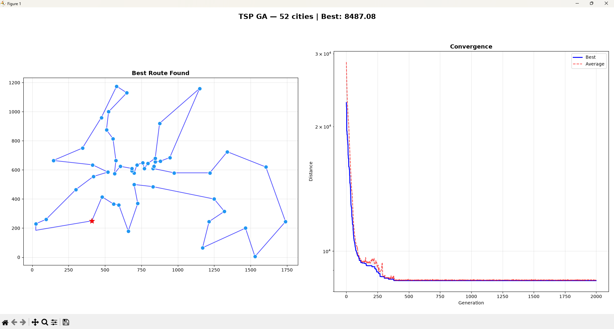

# TSP Genetic Algorithm Solver

[](https://github.com/RezaSparks/tsp-ga-solver/actions)

A cross-platform C++17 implementation of a Genetic Algorithm to solve the Traveling Salesman Problem (TSP), with **matplotlib visualization**, TSPLIB support, and multiple selectable GA operators.

## ✨ Features

- 🎯 **High-performance C++17 GA core** — Tournament selection, elitism, and configurable operators
- 📊 **Beautiful matplotlib visualizations** — Route plots, convergence curves, and combined dashboards
- 🗺️ **TSPLIB support** — Load real-world benchmark instances (EUC_2D)
- 📁 **CSV import/export** — Load custom city sets and export results
- 🔬 **Multiple GA operators** — Three crossover (OX, PMX, Cycle) and three mutation (Swap, Inversion, Scramble) operators
- 🏃 **Multiple independent runs** — Aggregate statistics (best/worst/avg/stddev) across runs
- 📈 **Convergence tracking** — Per-generation best/average fitness export
- 🎲 **Reproducible runs** — Fixed seed support for deterministic results
- 🧪 **Unit tested** — 18 tests across 5 test suites
- 🖥️ **Cross-platform** — Linux, macOS, Windows via CMake

## 🚀 Quick Start

### 1. Clone & Build

```bash
git clone https://github.com/RezaSparks/tsp-ga-solver.git
cd tsp-ga-solver
cmake -B build -DCMAKE_BUILD_TYPE=Release
cmake --build build --config Release
```

> **Requirements:** CMake 3.16+, C++17 compiler (GCC, Clang, or MSVC)

### 2. Run the Solver

```bash
# Random cities
./build/tsp_solver --cities 30 --population 100 --generations 500

# TSPLIB benchmark
./build/tsp_solver --tsplib examples/berlin52.tsp --population 200 --generations 1000

# Multiple runs with statistics
./build/tsp_solver --tsplib examples/berlin52.tsp --runs 10 --seed 42
```

### 3. Visualize Results

```bash
# Install Python dependencies
pip install -r scripts/requirements.txt

# Plot the best route
python scripts/plot_route.py output_<timestamp>/

# Plot convergence curve
python scripts/plot_convergence.py output_<timestamp>/

# Combined dashboard
python scripts/plot_dashboard.py output_<timestamp>/
```

All plots are saved as high-resolution PNG files automatically.

## 📸 Demo



*Best route found for the `berlin52` TSPLIB instance (52 cities) using OX crossover + inversion mutation, seed 42. Generated via matplotlib from solver output data.*

## 📖 Usage

### Basic CLI

```bash
./tsp_solver [OPTIONS]
```

| Flag | Default | Description |
|------|---------|-------------|
| `--cities, -n` | 20 | Number of random cities to generate |
| `--population, -p` | 100 | Population size (min: 4) |
| `--generations, -g` | 500 | Number of generations |
| `--mutation-rate, -m` | 0.02 | Mutation probability (0.0–1.0) |
| `--crossover` | `ox` | Crossover: `ox`, `pmx`, `cycle` |
| `--mutation` | `swap` | Mutation: `swap`, `inversion`, `scramble` |
| `--tsplib` | — | Load from TSPLIB `.tsp` file (EUC_2D) |
| `--csv` | — | Load from CSV file (header: `x,y`) |
| `--runs` | 1 | Number of independent runs |
| `--seed` | 0 | Random seed (0 = auto) |
| `--output-csv` | — | Export convergence data to CSV |
| `--help, -h` | — | Show help |

### Examples

**Random cities with custom operators:**
```bash
./tsp_solver --cities 50 --population 200 --generations 1000     --crossover ox --mutation inversion --mutation-rate 0.03
```

**TSPLIB with convergence export:**
```bash
./tsp_solver --tsplib examples/berlin52.tsp     --population 300 --generations 2000 --output-csv convergence.csv
```

**Reproducible benchmark run:**
```bash
./tsp_solver --tsplib examples/berlin52.tsp --runs 10     --population 300 --generations 2000 --seed 200
```

## 📊 Visualization Scripts

The `scripts/` directory contains Python tools for analyzing solver output:

| Script | Purpose | Output |
|--------|---------|--------|
| `plot_route.py` | Plot the best-found route | `route.png` |
| `plot_convergence.py` | Plot fitness over generations | `convergence.png` |
| `plot_dashboard.py` | Combined route + convergence | `dashboard.png` |

All scripts accept either a directory path (auto-detects files) or individual CSV files:

```bash
python scripts/plot_dashboard.py output_1234567890/     # directory mode
python scripts/plot_route.py best_route.csv              # file mode
```

## 🏗️ Project Structure

```
tsp-ga-solver/
├── src/                    # C++ source files
│   ├── main.cpp           # Entry point
│   ├── ga_core.cpp        # GA implementation
│   ├── tsp_loader.cpp     # CSV & TSPLIB parsers
│   └── cli_parser.cpp     # Command-line parsing
├── include/               # Header files
│   ├── ga/               # GA core (selection, crossover, mutation, elitism)
│   ├── tsp/              # City/distance logic, loaders
│   └── cli/              # CLI argument parsing
├── scripts/               # Python visualization tools
│   ├── plot_route.py
│   ├── plot_convergence.py
│   ├── plot_dashboard.py
│   └── requirements.txt
├── examples/              # Sample input files
│   ├── berlin52.tsp
│   └── cities_20.csv
├── tests/                 # Unit tests (GoogleTest)
├── CMakeLists.txt
└── README.md
```

## 🧪 Testing

```bash
cmake -B build -DTSP_BUILD_TESTS=ON
cmake --build build
ctest --test-dir build --output-on-failure
```

**18 tests across 5 suites:**

| Suite | Coverage |
|-------|----------|
| `DistanceTest` | Euclidean distance correctness, symmetry |
| `CrossoverValidity` | OX, PMX, Cycle produce valid permutations |
| `MutationValidity` | Swap, Inversion, Scramble preserve validity |
| `ElitismProperty` | Best fitness never worsens |
| `CsvLoader` | CSV parsing and error handling |

## 📈 Benchmarks

Results against `berlin52.tsp` (52 cities, optimal: **7542**), 10 runs each:

| Crossover | Mutation | Pop | Gens | Best | Avg | Worst | Std Dev | Gap |
|-----------|----------|-----|------|------|-----|-------|---------|-----|
| OX | Swap | 200 | 1000 | 8874.27 | 9636.52 | 10007.33 | 294.00 | +17.7% |
| PMX | Swap | 200 | 1000 | 9498.83 | 10538.72 | 11426.32 | 563.57 | +25.9% |
| Cycle | Swap | 200 | 1000 | 10554.94 | 11197.54 | 11947.18 | 477.54 | +39.9% |
| **OX** | **Inversion** | **300** | **2000** | **7825.42** | **8188.91** | **8470.43** | **225.92** | **+3.8%** |

**Key findings:**
- **OX** consistently outperforms PMX and Cycle
- **Inversion mutation** significantly improves results over Swap
- Within **~3.8% of optimal** for berlin52 without local search

Reproduce:
```bash
./build/tsp_solver --headless --tsplib examples/berlin52.tsp     --population 300 --generations 2000 --mutation-rate 0.03     --crossover ox --mutation inversion --runs 10 --seed 200
```

## 🗺️ Roadmap

- [x] C++17 GA core with multiple operators
- [x] TSPLIB & CSV support
- [x] Convergence data export
- [x] Unit tests (GoogleTest)
- [x] Matplotlib visualization suite
- [ ] Save/export best route to file
- [ ] Additional TSPLIB distance types (ATT, CEIL_2D, GEO)
- [ ] 2-opt local search hybrid
- [ ] Animated evolution GIF generation
- [ ] Live web demo

## 🤝 Contributing

Contributions are welcome! Please feel free to submit issues or pull requests.

## 📄 License

MIT License — see [LICENSE](LICENSE) for details.
